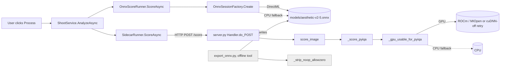
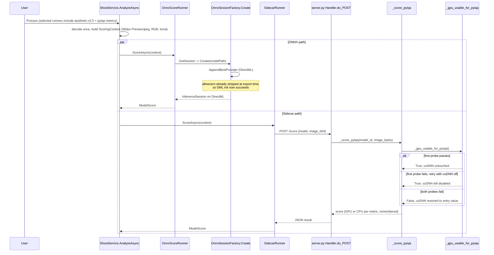

# Walkthrough: two independent reasons scorers were stuck on CPU

**Branch:** `gpu-scorers` · **Commit:** `b7525a1` (nothing on this branch is committed yet — every
anchor below is file+line against the current working tree, not a hash) · **PR:** not yet raised.

Every scorer that could run on this machine's GPU was running on the CPU instead, for two unrelated
reasons — and both reasons were explained *wrongly* in the codebase's own comments, which is why
neither had been fixed before now. This machine runs an RX 7900 XTX, with torch 2.10.0+rocm7.14,
onnxruntime-directml 1.24.4, and pyiqa 0.1.15 installed. `torch.onnx.export(dynamo=True)` stamps a
no-op `allowzero=1` attribute onto every `Reshape` node it emits, and DirectML's operator layer
rejects it on the aesthetic-predictor-v2.5 graph specifically, so that model silently fell back to
CPU. Separately, a batch-norm probe in the Python sidecar was failing — not because the GPU cannot
do batch norm, as the comment claimed, but because the ROCm 7.14 Windows wheel ships no libc++
headers for MIOpen's JIT compiler — and because that one probe gates every pyiqa metric globally,
ten metrics that would have run fine on the GPU were never even tried, and one of them (TOPIQ face)
produced no score at all.

**Out of scope:** no new models or runners, no change to the `IModelRunner` seam, `ShootService`, or
caching, no UI change. `OnnxSessionFactory`'s CPU-fallback *behaviour* is unchanged, only its
comment. The ROCm wheel itself is not being fixed and no libc++ headers are being vendored. The
sidecar's 300 s HTTP timeout is untouched. Whether any of this is actually *faster* is explicitly
not claimed here except for one model — see Decisions, aesthetic-predictor-v2.5.

## Architecture

`export_onnx.py` is offline tooling, not part of the request path — it runs once to regenerate
`models/aesthetic-v2-5.onnx`, which is gitignored build output that `Monocle.App.csproj`'s
`<None Include="..\..\models\*.onnx*">` glob then copies alongside the app. Everything downstream
of that file (`OnnxSessionFactory`, the runner) is unaffected by *how* the file was produced, only
by what it now contains.

## Sequence — a Process click hitting both fixed paths

## Change table

| File | Change | Notes |
| --- | --- | --- |
| `python/export_onnx.py` | New `_strip_noop_allowzero`, called from `_export` for every export | The exporter-side fix |
| `python/test_export_onnx.py` | New file, 7 tests | Untracked; covers the strip's three "leave it alone" branches plus the ordinary case |
| `python/server.py` | `_gpu_usable_for_pyiqa` now retries with cuDNN off; corrected docstrings | The sidecar-side fix |
| `python/test_server.py` | 5 new tests for the probe/retry/restore behaviour | Stubs `torch` via `sys.modules` |
| `src/Monocle.Models/Onnx/OnnxSessionFactory.cs` | Comment only — drops the wrong "can't compile this graph" claim | No behaviour change |
| `src/Monocle.Models/UnsupportedModelCatalog.cs` | Comment only — replaces "hardware limit" with "packaging gap" | No behaviour change |
| `.claude/agent-memory/sidekick/monocle-build-workflow.md` | Sidekick agent memory, records the fix | **Ignore this** for review purposes — not product code |
| `.claude/agent-memory/sidekick/python-sidecar-conventions.md` | Sidekick agent memory, records the fix and the testing pattern | **Ignore this** for review purposes — not product code |
| `version.txt` | 0.1.115 → 0.1.118 | **Ignore this** — `Monocle.App.csproj`'s auto-incrementing build stamp, not a deliberate change |

## The flow

| Entrypoint | Trigger | First changed file it reaches |
| --- | --- | --- |
| Process command | User action in the app | `src/Monocle.Models/ShootService.cs:49` (`AnalyzeAsync`, unchanged) forking into the two paths below |

`ShootService.AnalyzeAsync` (unchanged by this diff) decodes each frame once, builds a shared
`ScoringContext` carrying a 360px-long-edge preview JPEG (`ThumbLongEdge = 360`,
`ShootService.cs:17`), and loops the selected `IModelRunner`s (`ShootService.cs:98`). Two of those
runners are where this change lives.

**Path 1 — the ONNX runner.** `OnnxScoreRunner.ScoreAsync` (`Onnx/OnnxScoreRunner.cs:60`) lazily
builds a session via `OnnxSessionFactory.Create` (`Onnx/OnnxSessionFactory.cs:19`), which tries
DirectML first and falls back to CPU only if the GPU session throws during construction
(`OnnxSessionFactory.cs:41`). That fallback path is exactly where aesthetic-predictor-v2.5 was
landing: DirectML raised `80070057` at construction and the `catch` silently retried on CPU. This
diff does not touch that catch — it removes the reason the catch was being hit, by fixing the
`.onnx` file the session is built from. Follow that upstream to where the file is produced:
`export_onnx.py`'s `_export` (`python/export_onnx.py:146`), which now calls the new
`_strip_noop_allowzero` (`export_onnx.py:85`) right after `torch.onnx.export` and before
`onnx.checker.check_model`.

**Path 2 — the sidecar runner.** `SidecarRunner.ScoreAsync` (`Sidecar/SidecarRunner.cs:76`) POSTs
the same preview JPEG to the sidecar over HTTP. The request lands at `Handler.do_POST`
(`python/server.py:573`), dispatches through `score_image` (`server.py:542`) to `_score_pyiqa`
(`server.py:359`) for any of the ten pyiqa metrics, which calls `_gpu_usable_for_pyiqa`
(`server.py:244`) to decide the device. That function's batch-norm probe is what this diff changes.

## The decisions

### `export_onnx.py` — strip the no-op attribute at the exporter, not the loader

- **Decided:** `_strip_noop_allowzero` (`export_onnx.py:85`) runs after every export in `_export`
  (`export_onnx.py:154`), unconditionally — including the `dynamo=False` path that produces
  `nima.onnx`, not only the `dynamo=True` path that produces aesthetic-v2.5.
- **Why:** `models/*.onnx` are gitignored build output produced by this script, so the exporter is
  where the defect enters; fixing it at load would mean rewriting the graph in C# on every session
  construction to undo something the export should never have written in the first place. Running
  it unconditionally rather than gating on `dynamo=True` costs nothing — the function is a no-op
  when no `allowzero` attribute is present — and avoids the exporter's output silently depending on
  which internal branch produced it.
- **Alternatives considered:** lowering `GraphOptimizationLevel` for the DirectML attempt — tested
  and rejected, the init fails identically at every optimization level, so optimization was never
  the cause. Adding aesthetic-v2.5 to a known-bad-for-DML list so the failed init is skipped —
  rejected, it makes a fixable defect permanent instead of fixing it. Re-exporting with
  `dynamo=False` — rejected untested, it changes the whole export path to dodge one attribute.
- **Forced by:** `models/*.onnx` being gitignored build output, which puts the exporter, not the
  loader, in the position to own the fix.

**Why the strip is conservative, and why that matters here.** `allowzero=1` only changes what a
`Reshape` computes when its target shape contains a literal `0` — normally a `0` in a target shape
means "copy this dimension's size from the input", but under `allowzero=1` it means "make this
dimension zero". The strip (`export_onnx.py:110`–`122`) only removes the attribute when the shape
input resolves to a graph initializer (a compile-time constant, not something computed at run
time), that initializer's value is actually available to inspect (not itself pushed to external
data), and it contains no `0`. Anything else keeps the attribute, because guessing would silently
change what the graph computes. `python/test_export_onnx.py` exercises exactly those three
"leave it alone" branches plus the ordinary strip case — see Tests below.

**Why the DirectML rejection is now explained more cautiously.** The original comment (and the
brief this run started from) said DirectML "rejects the attribute outright." That turned out to be
too strong: `nima.onnx`, produced by the older `dynamo=False` path, also carries one `allowzero`
Reshape and initializes on DirectML without complaint. So DirectML's `80070057` failure is
pattern- or shape-specific to the aesthetic-v2.5 graph, not triggered by the attribute's mere
presence. This doesn't change what the fix does — removing a provably no-op attribute can never
change what a graph computes, regardless of why DirectML objects to it — but it does mean the
docstring on `_strip_noop_allowzero` (`export_onnx.py:85`–`94`) had to be softened from a
categorical claim to what was actually observed, and it's the reason `nima.onnx` gets re-exported
through the same code path even though nothing was wrong with it.

**Rewriting the file in place, not the in-memory export.** `_strip_noop_allowzero` reloads the file
`_export` just wrote with `onnx.load(str(path), load_external_data=False)`, mutates the small graph
proto, and writes it back — it never touches `aesthetic-v2-5.onnx.data`, the ~1.7 GB external-weights
file, because the initializers loaded under `load_external_data=False` are only the small shape
constants (`export_onnx.py:107`). This was verified during implementation: the `.data` file stays
byte-identical in size (1,719,640,064 bytes) while the graph proto shrinks. The write itself goes
through a same-directory `<path>.tmp` plus `os.replace` (`export_onnx.py:124`–`143`), because
`onnx.save_model` is not atomic and this file is loaded by the app at startup with no integrity
check — an interruption mid-write would otherwise leave a silently corrupt model where the app
expects a working one, rather than a loud failure.

### `server.py` — the probe retries once with cuDNN off, and self-calibrates

- **Decided:** `_gpu_usable_for_pyiqa` (`server.py:244`) still probes a `1x8x16x16` batch-norm
  forward as before, but on failure it now disables `torch.backends.cudnn.enabled` and probes once
  more (`server.py:279`–`290`) before giving up. If the retry succeeds, cuDNN stays disabled for the
  rest of the process — that's what routes MIOpen calls off the JIT path that was failing. If the
  retry also fails, cuDNN is restored to whatever it held *on entry* (`had = torch.backends.cudnn.enabled`
  captured before the first attempt), not hardcoded back to `True`.
- **Why the mechanism works at all:** the earlier comment said the GPU "dies compiling MIOpen's
  batch-norm kernel" — true as an observation, false as an explanation. MIOpen JIT-compiles its
  kernels through hipRTC, and TheRock's ROCm 7.14 Windows wheel ships no libc++ headers, so *any*
  MIOpen kernel that pulls in a C++ stdlib header fails to build — batch-norm is simply the op this
  probe happens to exercise, not the op uniquely affected. Disabling cuDNN routes PyTorch to its own
  precompiled kernels for the same op instead of MIOpen's JIT path, which is why the retry passes.
  It is a wheel packaging gap, not a hardware limit.
- **Why restore-to-entry-value and not restore-to-True:** the flag is process-global and the sidecar
  hosts more than the pyiqa metrics — leaving it disabled when disabling it bought nothing
  contradicts constraint 1 (never touch MIOpen/cuDNN unconditionally), but so would clobbering
  whatever value something upstream had deliberately set before this probe ran. Save-and-restore is
  the only shape that respects both.
- **Alternatives considered:** hardcoding a per-metric CPU/GPU table instead of probing — rejected,
  it would have to be hand-maintained per machine and per pyiqa version, and it was exactly the kind
  of guess the wrong "MIOpen can't do batch norm" story invited. Leaving cuDNN disabled after a
  failed retry — rejected as a global side effect bought for nothing.
- **Forced by:** hard constraint 1 from the brief — the probe must stay self-calibrating, never
  disabling MIOpen unconditionally, so a healthy CUDA/cuDNN box keeps cuDNN on.

**A defect that entered through the brief, not the implementation — `cor-001`.** The docstring on
`_score_pyiqa` originally stated specific per-metric GPU timings as settled fact. That happened
because the lead handed those numbers to the implementing sidekick as part of its brief, then
withdrew them from the brief afterwards on realizing they'd been measured at the wrong resolution
(2048×1365, when the app actually posts a 360px preview — about 32× fewer pixels) on a GPU shared
with other work on this machine, so neither device's numbers were trustworthy. The sidekick wrote
exactly what its brief told it to write; two independent review lanes (`cor-001` in Correctness,
`struct-001` in Structure, the same docstring found from two directions) caught the stale claim
before it shipped. The docstring at `server.py:359`–`373` now rests the pyiqa half of this change on
two things that need no timing at all: every metric being gated off the GPU by one global probe
before this fix, and TOPIQ (face) previously producing no score at all — plus the premise, accepted
from the user rather than benchmarked here, that the GPU is in fact faster once it's reachable. It
does not, and should not, claim a measured speedup for any pyiqa metric.

**One measured number does appear, and only one.** aesthetic-predictor-v2.5 runs at a fixed 384×384
input regardless of the source image, so resolution-dependence doesn't apply to it the way it does
to the pyiqa metrics. 7.420 s/frame on CPU versus 0.769 s/frame on DirectML was measured at exactly
that fixed size, and GPU contention on this shared machine would only have made the DirectML number
*worse* — so it's a legitimate floor, not an optimistic estimate. Nothing else in this change states
a speedup as fact.

### `UnsupportedModelCatalog.cs` and `OnnxSessionFactory.cs` — correcting, not just rewording

- **Decided:** `UnsupportedModelCatalog.cs:19`–`24` now says a metric can be taken off the GPU by "a
  ROCm wheel packaging gap, not a hardware limit," naming `_gpu_usable_for_pyiqa` as the mechanism,
  rather than the previous "MIOpen won't compile" story. `OnnxSessionFactory.cs:37`–`40` drops the
  "can't compile this graph" framing for "a DML/CUDA/ROCm operator rejecting something about that
  graph" — deliberately vaguer, because after the `nima.onnx` finding above, "can't compile" is no
  longer something this comment can honestly assert about DirectML in general.
- **Why `UnsupportedModelCatalog.cs` keeps *one* clause naming the mechanism, rather than dropping
  it entirely as one review lane (`struct-002`) proposed:** the reviewer's instinct was right in
  general — a model catalogue file shouldn't carry another process's implementation detail — but the
  reason this comment was being touched at all is that its *previous* text asserted a specific wrong
  cause, and that wrongness is what made the defect look like an unfixable hardware limit for weeks.
  Replacing "merely wrong" with "merely vague" would invite the next reader to re-derive the same
  wrong conclusion from a comment that no longer says anything. So the fix keeps one clause stating
  the cause is a packaging gap and moves the hipRTC/libc++ mechanism detail out to
  `_gpu_usable_for_pyiqa`'s own docstring, where it belongs. The round-2 review lane endorsed the
  narrowed remedy on its own merits, not just as a compromise.
- **Forced by:** nothing external — this was a judgement call made explicitly in triage, not a
  constraint from the brief.

### Test changes — one override of an explicit instruction, confirmed correct

- **Decided (fix phase):** rather than editing the existing cuDNN-restore test in place, as the fix
  brief asked, a second test was added:
  `test_probe_failing_twice_restores_cudnn_to_false_when_that_was_the_entry_value`
  (`python/test_server.py`, alongside `test_probe_failing_twice_reports_unusable_and_restores_cudnn_to_entry_value`).
- **Why:** the existing test's entry value for `cudnn.enabled` is `True` — which is also the stub's
  hardcoded default in the old (buggy) code. A test built around that entry value cannot tell
  "restored to `True`" apart from "restored to the entry value", which is exactly the distinction
  `cor-002` was about. Editing it in place, as instructed, would have produced a test that still
  passed on the bug it was meant to catch.
- **The instruction was overridden on evidence, not on preference**, and it was put to the round-2
  Correctness lane rather than taken on the implementer's word alone. The lane confirmed: "the
  two-test split correctly distinguishes 'restored to True' from 'restored to entry value'."

## Where to look to review this

In priority order:

1. `python/server.py:267`–`291` (`_gpu_usable_for_pyiqa`) — the probe/retry/restore logic. This is
   the core of the sidecar-side fix; get the restore-to-entry-value behaviour right and everything
   downstream follows.
2. `python/export_onnx.py:85`–`143` (`_strip_noop_allowzero`) — the three conservatism checks
   (constant, no external data, no zero in the shape) are what stand between this being a provable
   no-op and a silent graph-correctness bug.
3. `python/test_server.py:136`–`296` — the five new probe tests (and their `torch`-stubbing
   helpers), especially the two
   `test_probe_failing_twice_*` tests, since they're the pair that only together prove the restore
   target is correct (see the override above).
4. `python/test_export_onnx.py:101`–`143` — the "keeps allowzero" test built to fail loudly (an
   ONNX Runtime exception, not a silently wrong shape) if the zero-guard regresses.
5. `src/Monocle.Models/UnsupportedModelCatalog.cs:19`–`24` and
   `src/Monocle.Models/Onnx/OnnxSessionFactory.cs:37`–`40` — comment-only, but worth confirming they
   no longer assert anything this diff disproved.

## Tests

`python/test_server.py` grew from 9 tests to 14; the 5 new ones cover: a healthy first probe leaves
`cudnn.enabled` untouched, a failing-then-passing retry leaves it disabled, a failing-twice retry
restores it to the entry value (tested at both `True` and `False` entry values — the two-test split
described above), and a not-ready GPU never even imports `torch` (proven with a stub whose
`__getattr__` raises on any access, not by asserting a side effect's absence). All of them stub
`torch` via `sys.modules` so they run without a GPU and in CI.

`python/test_export_onnx.py` is new, 7 tests, exercising the ordinary strip case, all three
"leave it alone" branches (shape contains a zero, shape isn't a constant, shape initializer is
external data), that non-`Reshape` nodes are never touched even if they happen to carry an
`allowzero` attribute, and that a successful strip leaves no `.tmp` file behind. The
"shape contains a zero" test is built so a regression fails loudly — it constructs a case where the
two interpretations of `allowzero` produce a different *validity*, not just a different number, so a
wrongful strip raises inside ONNX Runtime rather than quietly returning a different shape.

Not covered by any test: the actual DirectML/ROCm hardware paths. The round-1 Tests lane reproduced
both mutation proofs in a scratch worktree (disabling the zero-guard fails the strip test; forcing
cuDNN off on the success path fails the probe test) rather than trusting the implementer's report,
and Correctness independently re-verified the regenerated `aesthetic-v2-5.onnx` initializes on
`DmlExecutionProvider` and matches the CPU score to 3.8746819 vs 3.8746817. Verification
(Phase 8, run unconditionally because `models/aesthetic-v2-5.onnx` is a gitignored artifact this
diff regenerates, invisible to `git diff`) independently re-derived: 170/170 `Reshape` nodes
stripped safely, the `.data` file intact at 1,719,640,064 bytes, and re-export proved safe for
`nima.onnx` too.

## Open questions

- The `allowzero` strip is a general property of `dynamo=True` exports, not something specific to
  aesthetic-v2.5. Verification confirmed re-export is safe for `nima.onnx` too, which closes the
  round-1 open question about whether the pass is a no-op there. It is not a no-op — NIMA carries one
  such Reshape and works on DML regardless, so DirectML's rejection is pattern- or shape-specific
  rather than triggered by the attribute's presence. The strip is still safe because removing a
  provable no-op cannot change what a graph computes.
- Verification's `ver-n02` concurrency observation stands as a genuine, accepted risk rather than a
  resolved one: a probe that writes process-global state inside a threaded server (`server.py`'s
  `ThreadingHTTPServer`, whose `/health` and `/score` paths both reach the probe) is defensible here
  only because of what the specific failure mode looks like on this machine — a cross-thread-visible
  write does happen (the pre-change probe never wrote `cudnn.enabled` at all, so this diff does
  introduce one), but every caller on a broken-MIOpen box converges on the same terminal state, and
  the only divergent window briefly leaves cuDNN off on a machine where MIOpen is already unusable.
  If the sidecar ever hosts something where cuDNN being briefly off matters, this becomes a real
  problem.
- `ver-n01`'s finding is unfixed by design: `src/Monocle.Models/Sidecar/SidecarClient.cs:17` still
  carries the same superseded "a CNN metric MIOpen won't compile" story — a fifth instance of the
  wrong explanation this run found, outside the three the brief originally enumerated (`cause:
  stale`, not fixed here). Whether the sidecar's docstrings deserve a dedicated sweep is a judgement
  for the next run, not this one.
